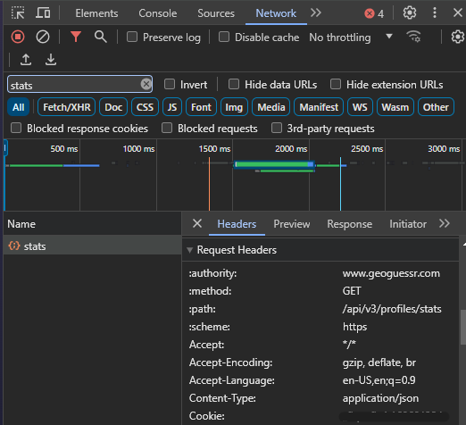
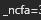

# GeoInsight

GeoInsight is a web application that analyses your GeoGuessr games and provides you with metrics and 
visualizations to better understand your style of play. 

The web application can be accessed [here](https://geo-insight.streamlit.app/).

If you want to install GeoInsight on your local machine, follow the instructions below.

## Prerequisites

Before you begin, ensure you have met the following requirements:
* You have installed the latest version of Python. 
* You have a Windows/Linux/Mac machine.

## Installing GeoInsight

To install GeoInsight, follow these steps:

Clone the repository onto your machine:

```
git clone https://github.com/SafwanSipai/geo-insight.git 
```

## Using GeoInsight

To use GeoInsight, follow these steps:

1. Go to the root of the folder (geo-insight) that was created when the repository was cloned.

2. Create a python virtual environment using the command: `python -m venv <env-name>`

3. Install the required libraries/dependencies: `pip install requirements.txt`

4. Activate the python environment (run the following commands in the root folder):

    | Platform | Command                |
    | :--------| :------------------------- |
    | bash/zsh | `source <env-name>/bin/activate` |
    | PowerShell | `<env-name>\Scripts\Activate.ps1` |
    | cmd.exe | `<env-name>\Scripts\activate.bat` |

5. Inside the terminal, run the command: `streamlit run app.py`

6. The web application will open in your browser.

## Getting your `_ncfa` cookie

1. Open your web browser and navigate to the GeoGuessr website.

2. Log in to your GeoGuessr account using your credentials.

3. Once logged in, open the developer tools in your web browser. You can usually do this by right-clicking on the webpage and selecting "Inspect" or by pressing Ctrl+Shift+I (Cmd+Option+I on Mac).

4. In the developer tools window, navigate to the "Network" tab.

5. With the network tab open, refresh the GeoGuessr webpage to capture the network traffic.

6. Use the filter on the top-left of the network tab to search for 'stats'.

7. Click on the 'stats' request to open it and view its details.

8. In the request headers section, locate the "_ncfa" cookie.

    

9. Copy the value of the "_ncfa" cookie (everything after the '=' sign until the ';', do not copy the ';').

    

10. Now, you can paste the copied "_ncfa" token into text box of the web application, where indicated.

## Security and Privacy

GeoInsight is completely secure for use. It DOES NOT establish any connections to a database, ensuring that neither the _ncfa cookie nor the associated data fetched through it is retained or stored anywhere. Upon exiting the web application, this data is promptly deleted. 

You are welcome to review the code yourself to confirm this assurance.

## Acknowledgement 

* [Geoguessr API guide](https://efisha.com/2022/04/18/geoguessr-api-endpoints/)

* [Fetching the _ncfa cookie](https://github.com/EvickaStudio/GeoGuessr-API?tab=readme-ov-file#authentication)